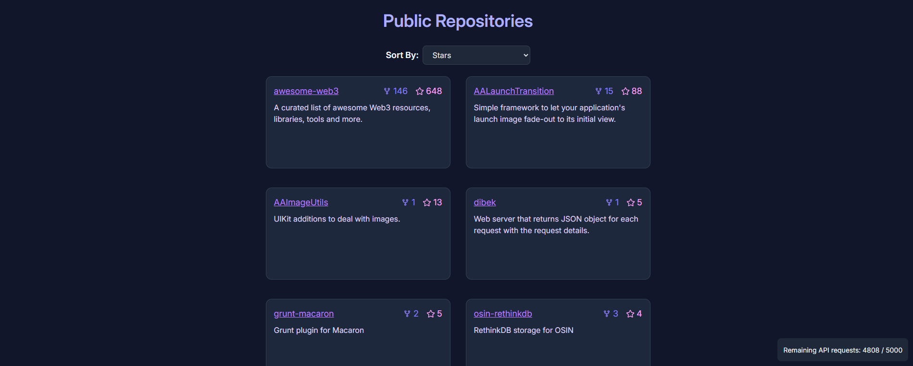

# 🚀 GitHub Profile Visualizer

A sleek web app to visualize GitHub profiles — explore repositories, language stats, and commit activity with beautiful interactive charts.

## Features

- ✅ Display a GitHub user's public repositories
- ✅ Show repository details (name, stars ⭐, forks 🍴)
- ✅ Pie chart for **language distribution**
- ✅ Line chart for last 6 months commit activity of top 3 recently updated repositories
- ✅ Fully responsive UI with smooth styling

---

## Tech Stack

| Layer           | Tools              |
| --------------- | ------------------ |
| **Frontend**    | React, TailwindCSS |
| **State**       | TanStack Query     |
| **Charts**      | Chart.js           |
| **Data Source** | GitHub REST API    |

---

## 📺 Live Demo

🔗 [git-profile-visualizer.vercel.app](https://git-profile-visualizer.vercel.app/)

---

## How to Run Locally

1. Clone the repository:

   ```sh
   git clone https://github.com/yigit22167/github-profile-visualizer.git

   ```

2. Navigate to the project folder:

   ```sh
   cd github-profile-visualizer

   ```

3. Install dependencies:

   ```sh
   npm install

   ```

4. Create a .env file in the root directory and add:

   ```sh
   VITE_GITHUB_TOKEN=your_github_api_token

   ```

5. Start the development server:
   ```sh
   npm run dev
   ```

### Screenshots

Landing Page


User Info


User Language Usage


User Commit Activity for most recently updated 3 repos


User's repositories and rate limit monitoring


### Status

Project is mostly finished.
